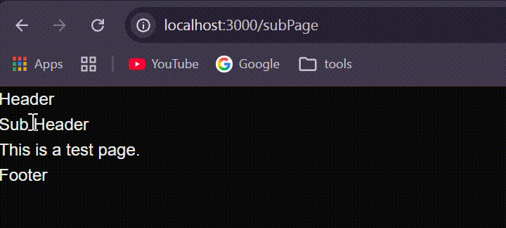
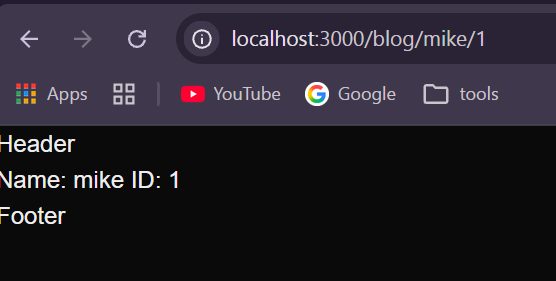
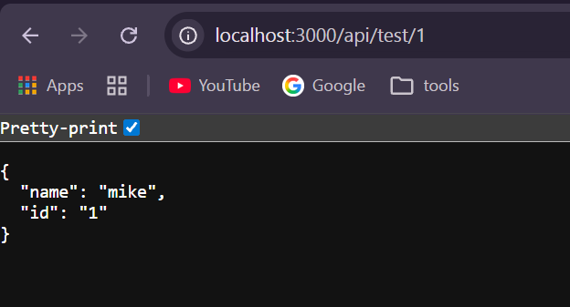
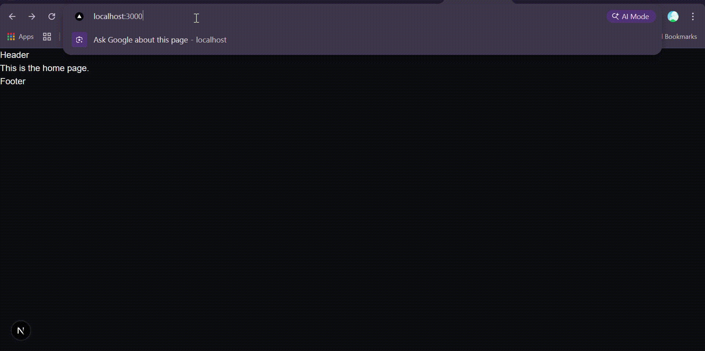
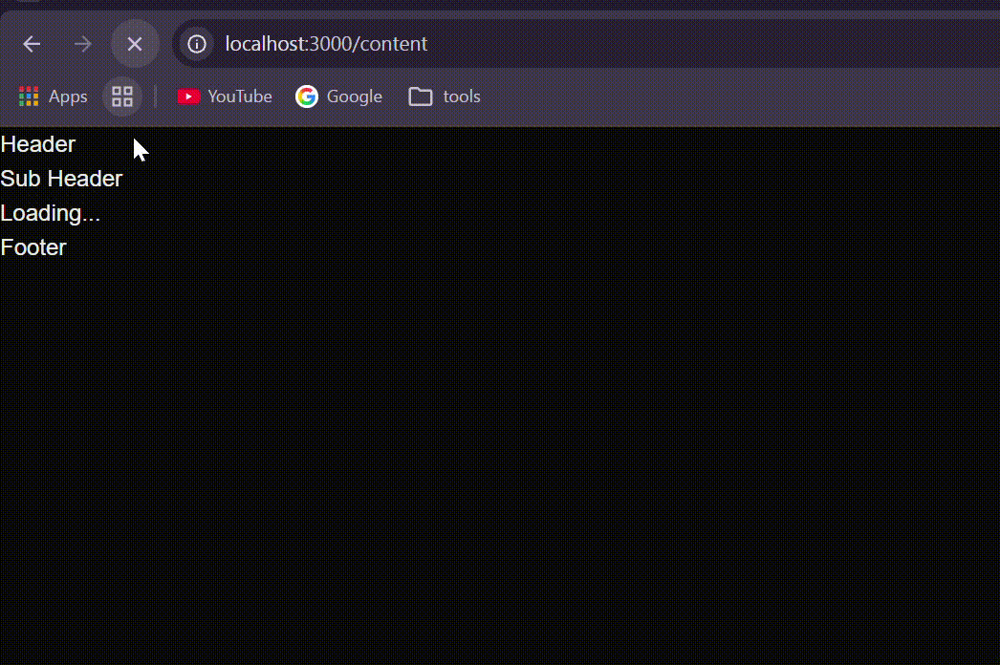
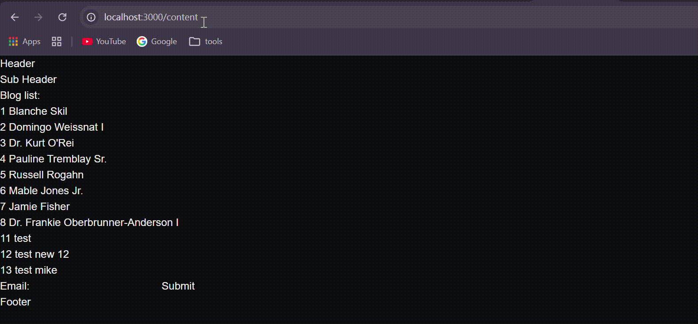

# Next.js tutorial

## Init project
`npx create-next-app@latest`

## 1. Router
App Router คือระบบจัดการเส้นทาง (routing) แบบใหม่ของ Next.js ที่ใช้โฟลเดอร์ `app/` เป็นศูนย์กลาง 

### Example 1: App Router
ดูการทำงานของ App Router
- `app/page.js` คือหน้าเริ่มต้นของ route นั้น
- `app/layout.js` คือโครงหลักที่ใช้ร่วมกันในหลายหน้า 
- `app/content/page.js` คือตัวอย่างหน้าที่ route ไป
- `app/content/layout.js` คือตัวอย่างหน้าที่ทำให้เห็นภาพว่า layout ทำงานยังไง




### Example 2: App Router
ทดลองดึงค่าผ่าน parameter
- `app/blog` parameter ตัวไหนที่อยากดึงให้ตั้งชื่อ floder นั้นด้วย [ ] ตามตัวอย่าง




### Example 3: Router Handdler
คือการสร้าง API 1 เส้น `/app/api/test/id`




## 2. Middelware
Middleware คือโค้ดที่รันก่อน request จะไปถึงหน้า page, route handler, หรือ API route
ใช้สำหรับตรวจสอบเงื่อนไขบางอย่าง เช่น
- เช็คว่า user login แล้วหรือยัง
- redirect คนที่ยังไม่ล็อกอิน
- ป้องกัน route บางเส้น
- เพิ่ม header หรือทำ log ของ request

### หลักการทำงาน
Next.js จะมองหาไฟล์ `middleware.js` ที่ root ของโปรเจกต์
ถ้ามี request เข้ามาแล้วตรงกับเงื่อนไขใน middleware ระบบจะให้ middleware จัดการก่อน
ถ้าเรียก `NextResponse.next()` หมายถึงให้ request ไปต่อเหมือนปกติ
ถ้าใช้ `redirect()` หรือ `rewrite()` ก็จะเปลี่ยนปลายทางของ request

### Example 1
ตัวอย่างการใช้ middleware เพื่อป้องกันหน้า `/content` ไม่ให้ใครเข้า กลับมาดูที่ terminal จะเจอที่ console.log ไว้



สรุปสั้น ๆ
- Middleware เหมาะกับ logic ที่ต้องทำก่อนเข้า route
- ทำงานที่ฝั่ง edge runtime
- ใช้ได้ดีมากกับ auth, redirect, rewrite และตรวจสอบ path

## 3. Server component vs Client component
ใน App Router ของ Next.js ไฟล์ใน `app/` จะเป็น **Server Component** โดย default
ถ้าต้องการให้ component ทำงานฝั่ง browser ให้ใส่ `'use client'` บรรทัดแรกของไฟล์

### ความต่างแบบสั้น ๆ
- Server Component
    - รันบน server
    - เหมาะกับการ fetch data, คุย database, จัดการข้อมูลที่ไม่อยาก expose ให้ browser
    - ขนาด JavaScript ที่ส่งไป browser จะน้อยกว่า (โหลดไวขึ้น)
- Client Component
    - รันบน browser
    - ใช้ state, effect, event handler ได้ เช่น `useState`, `useEffect`, `onClick`
    - เหมาะกับ UI ที่ต้องโต้ตอบกับผู้ใช้

### ใช้เมื่อไหร่
- ใช้ Server Component เมื่อ
    - ต้องดึงข้อมูลจาก API/DB ก่อน render
    - ต้องการ performance ที่ดีและลด bundle ฝั่ง client
- ใช้ Client Component เมื่อ
    - มีการกดปุ่ม, ฟอร์ม, state, animation
    - ต้องใช้ browser API เช่น `localStorage`, `window`

### Example 1: Server Component (default)
```javascript
// app/content/page.js
export default async function ContentPage() {
    const res = await fetch('https://jsonplaceholder.typicode.com/posts/1')
    const data = await res.json()

    return <h1>{data.title}</h1>
}
```

### Example 2: Client Component
```javascript
'use client'

import { useState } from 'react'

export default function Counter() {
    const [count, setCount] = useState(0)

    return (
        <button style={{ backgroundColor: 'blue' }} onClick={() => setCount(count + 1)} >
            count: {count}
        </button>
    )
}
```

### สรุปสั้น ๆ
- ถ้าไม่ต้องโต้ตอบมาก ใช้ Server Component ก่อน
- ถ้าต้องใช้ state หรือ event ค่อยแยกเป็น Client Component
- ปกติจะผสมกันได้ เช่น Page เป็น Server แล้วเรียกปุ่ม/ฟอร์มที่เป็น Client Component ข้างใน

## 4. Streaming
`content/loading.js`
คือการที่ client แสดงข้อมูลของหน้าในส่วนที่พร้อมก่อนออกมาได้เช่นในตัวอย่างนี้ Header, Footer คือส่วนที่พร้อมแล้ว และส่วนที่ fetch api ก็จะขึ้นว่า loading...




## 5. Server action
`contnt/page.js`
คือการสร้าง function ของ server ไว้ที่ client ได้



## Ref
- [doc พี่ไมค์](https://mikelopster.dev/posts/next-start)
- [next doc](https://nextjs.org/docs)